Nama : Maisya Puspita Sari
NIM : 2110131320006
Mata Kuliah : Sistem Operasi

____

### 1. Komponen Sistem Operasi

**1.1 Manajemen Sistem Berkas**

 Manajemen file adalah jenis perangkat lunak yang mengelola file data dalam sistem komputer. Sistem manajemen file menangani bagaimana file diatur, bukan hanya sekadar mengorganisir cara menyimpan saja. Sistem operasi bertanggung-jawab dalam aktivitas yang berhubungan dengan manajemen berkas: 
  
* Pembuatan dan penghapusan berkas. 
* Pembuatan dan penghapusan direktori. 
* Mendukung manipulasi berkas dan direktori. 
* Memetakan berkas ke secondary-storage. 
* Mem-back-up berkas ke media penyimpanan yang permanen (non-volatile).
* Sistem operasi mengimplementasikan konsep abstrak dari berkas dengan mengatur media penyimpanan massa, misalnya tapes dan disk. 
 

 

 Menuju Manajemen Berkas 

 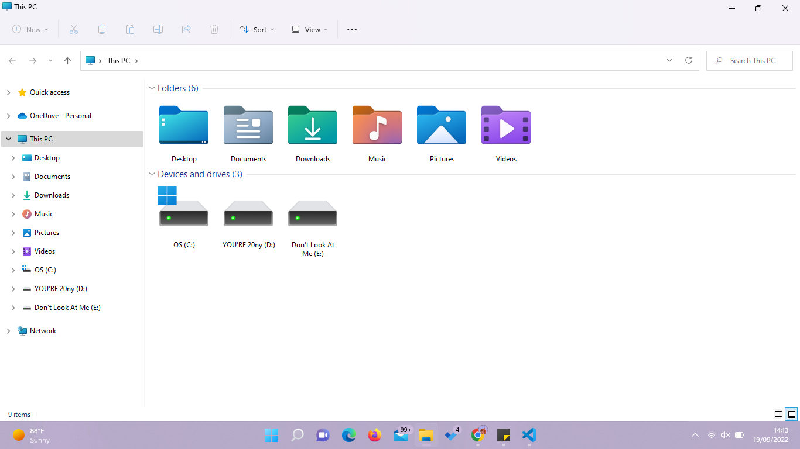

 Menuju Local Disk (D) 

 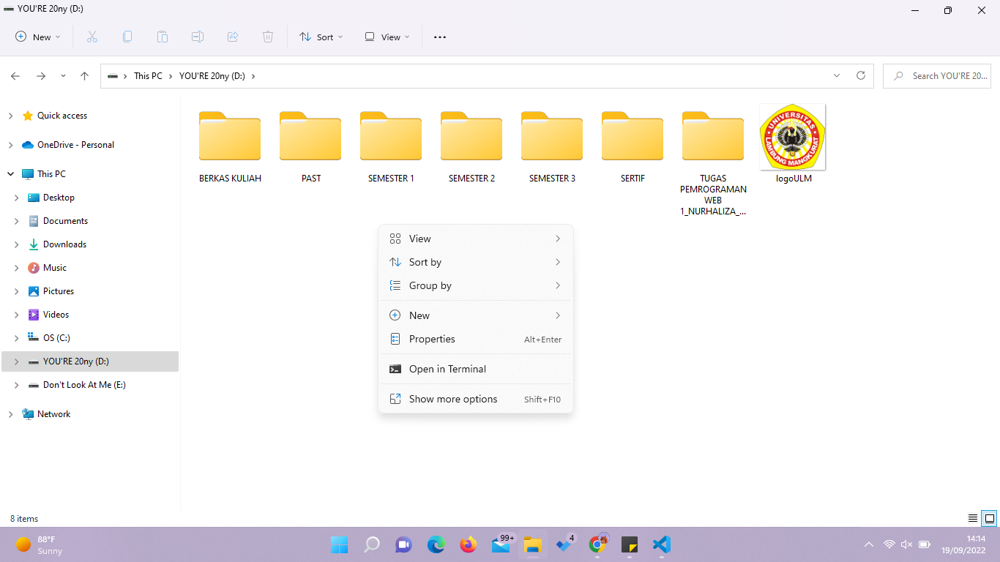

 Klik kanan, pilih menu 'New'. 

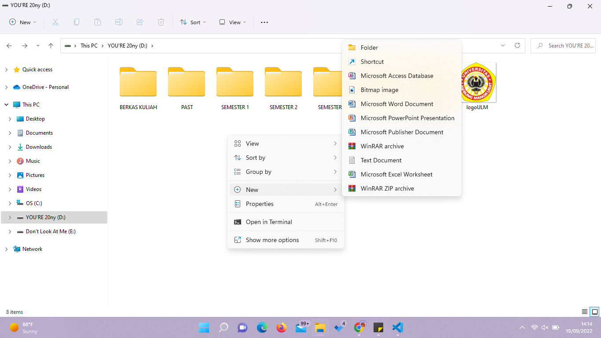

 Setelahnya menu lainnya akan terbuka kearah kanan. Pilih yang 'Folder'.

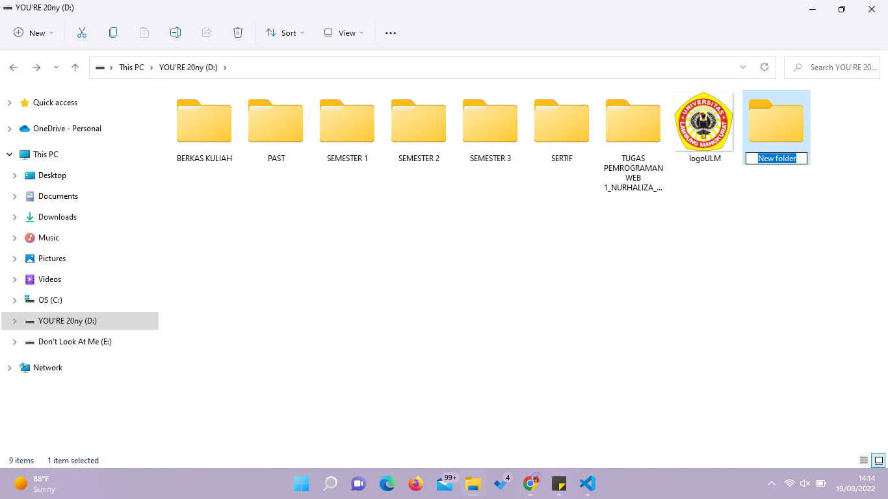

Folder baru akan muncul. 

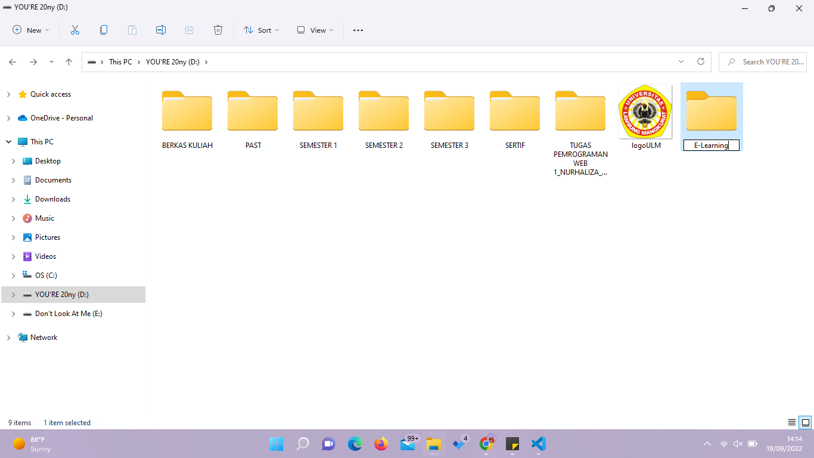

 Menamakan folder dengan nama E-Learning

Folder telah jadi. Awalnya letaknya diujung.

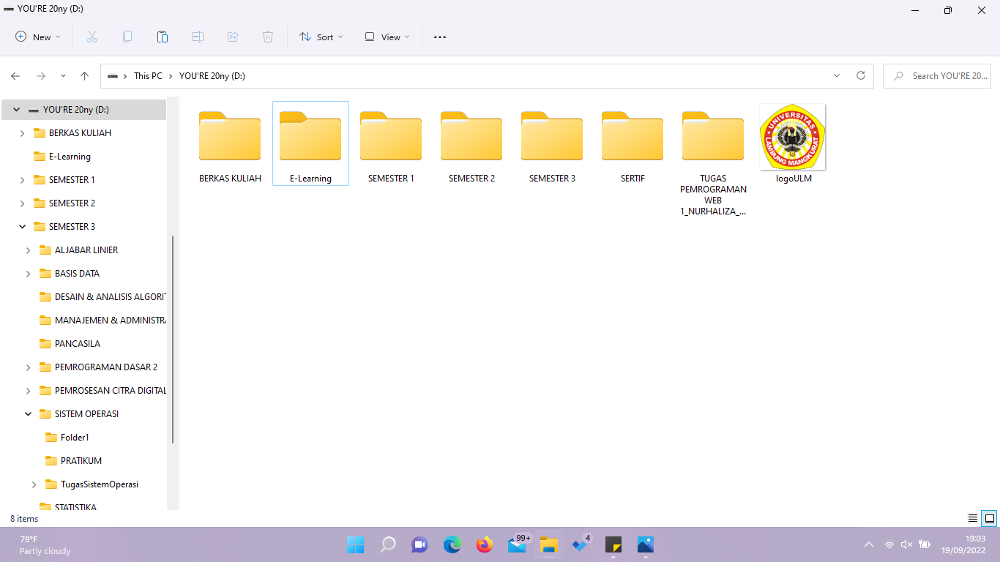

 Dengan manajemen berkas sistem operasi maka penyusunan folder akan terurut sesuai abjad. Sehingga folder 'E-Learning' berada diurutan kedua dari kiri.

**1.2 Manajemen Proses**

 Sistem operasi bertanggung-jawab atas aktivitas-aktivitas yang berkaitan dengan manajemen proses seperti: 

* Membuat dan menghapus proses pengguna dan sistem proses. 
* Menunda atau melanjutkan proses. 
* Menyediakan mekanisme untuk sinkronisasi proses. 
* Menyediakan mekanisme untuk komunikasi proses. 
* Menyediakan mekanisme untuk penanganan deadlock. 

Contohnya adalah seperti dibawah ini

**1.3 Manajemen Masukan/Keluaran**

 Komponen Sistem Operasi untuk sistem Masukan/Keluaran: 

* Penyangga: menampung sementara data dari/ke perangkat Masukan/Keluaran. 
* Spooling: melakukan penjadwalan pemakaian Masukan/Keluaran sistem supaya lebih efisien (antrian dsb.). 
* Menyediakan driver: untuk dapat melakukan operasi rinci untuk perangkat keras  Masukan/Keluaran tertentu. 

Contohnya seperti saat me-eject flashdisk.

 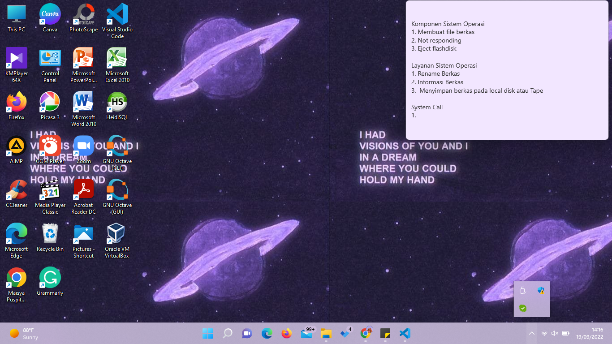

 Pada ujung kanan bawah pilih ikon serupa ^

 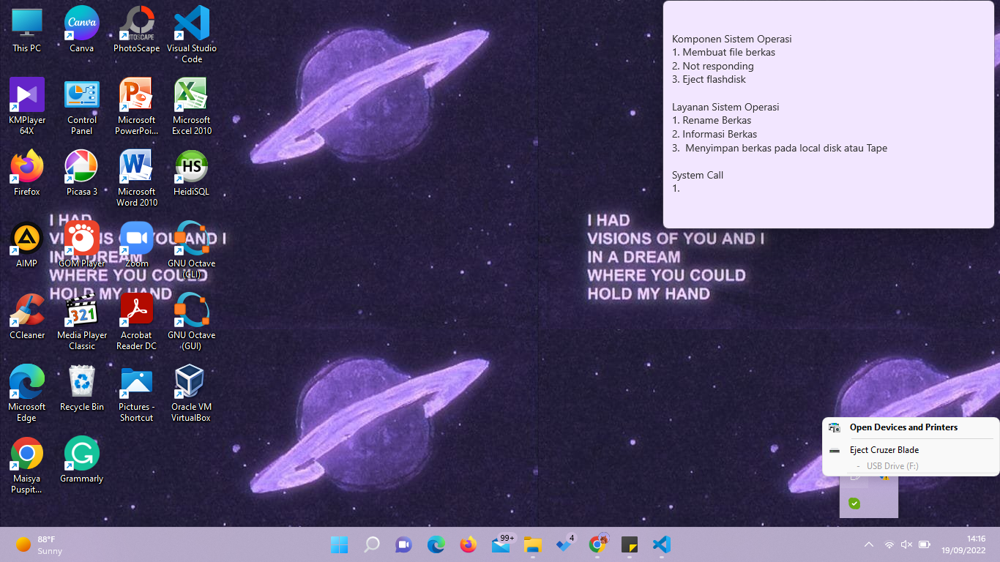

 Klik. Kemudian pilih 'Eject Cruzer Blade'.

### 2. Layanan Sistem Operasi
**2.1 Manipulasi Sistem Berkas.** 

*Program harus membaca dan menulis berkas, dan kadang kala juga harus membuat dan menghapus berkas. 
* Komunikasi. Kadang kala sebuah proses memerlukan informasi dari proses yang lain. Ada dua cara umum dimana komunikasi dapat dilakukan. Komunikasi dapat terjadi antara proses dalam satu komputer, atau antara proses yang berada dalam komputer yang berbeda, tetapi dihubungkan oleh jaringan komputer. Komunikasi dapat dilakukan dengan share-memory atau message-passing, dimana sejumlah informasi dipindahkan antara proses oleh sistem operasi. 
* Deteksi Error. Sistem operasi harus selalu waspada terhadap kemungkinan error. Error dapat terjadi di CPU dan memori perangkat keras, Masukan/Keluaran, dan di dalam program yang dijalankan pengguna. Untuk setiap jenis error sistem operasi harus bisa mengambil langkah yang tepat untuk mempertahankan jalannya proses komputasi. Misalnya dengan menghentikan jalannya program, mencoba kembali melakukan operasi yang dijalankan, atau melaporkan kesalahan yang terjadi agar pengguna dapat mengambil langkah selanjutnya. 

Contohnya Deteksi Eror, saat program 'not responding' dan lain sebagainya.

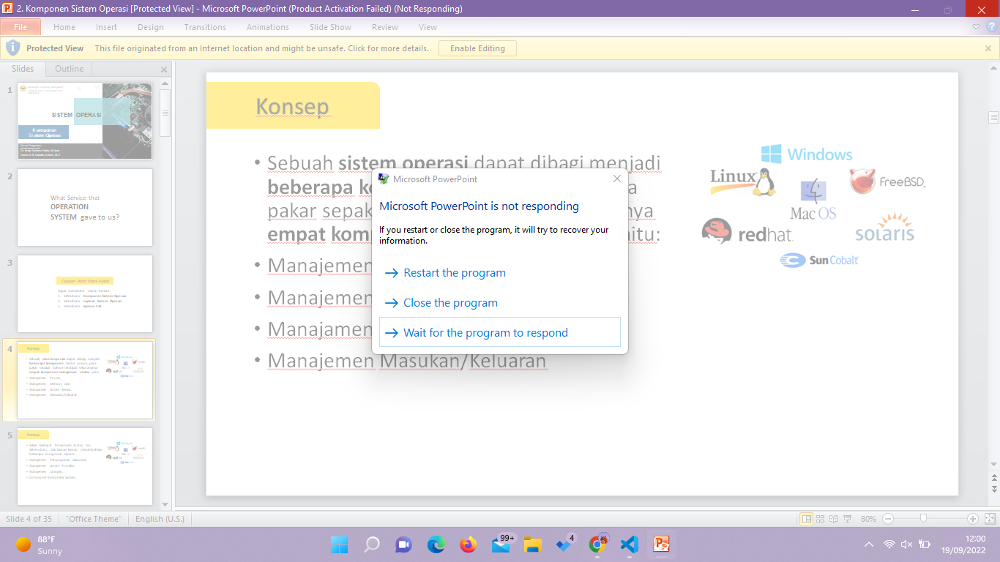
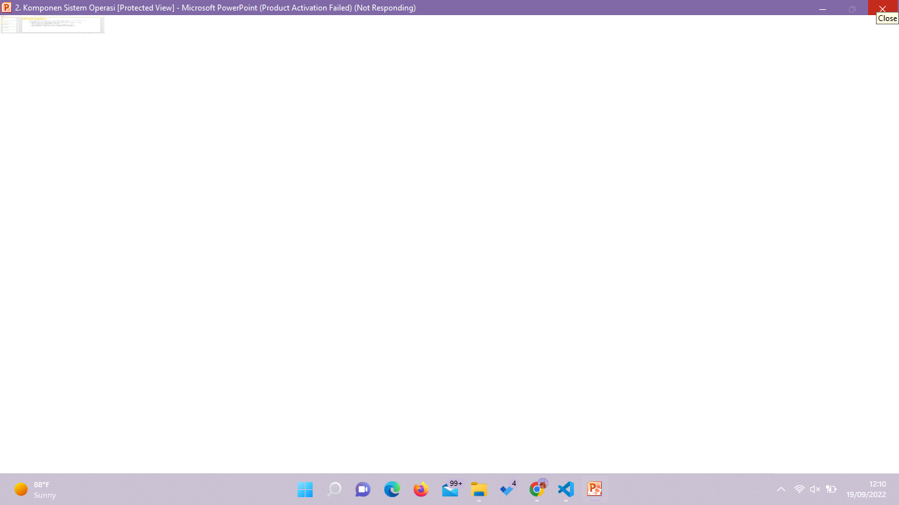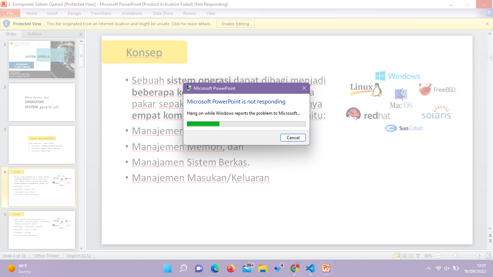

Contoh lainnya, menghapus berkas.

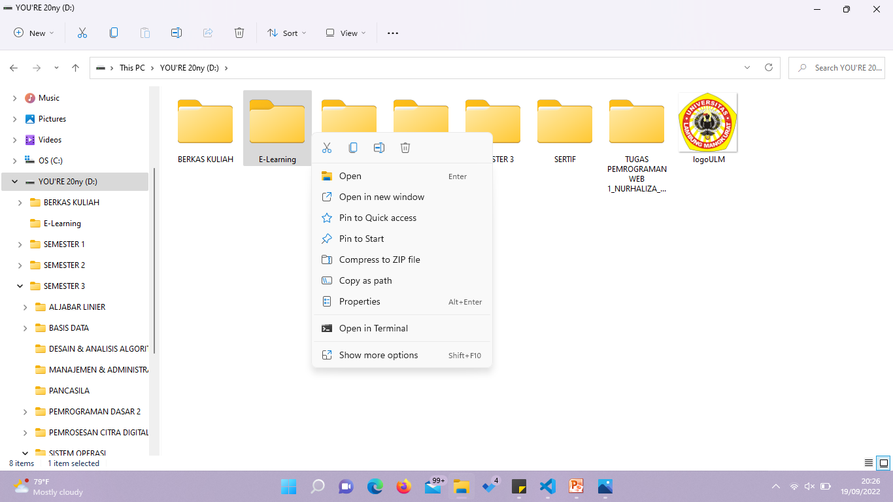

 Klik kanan pada berkas yang akan dihapus

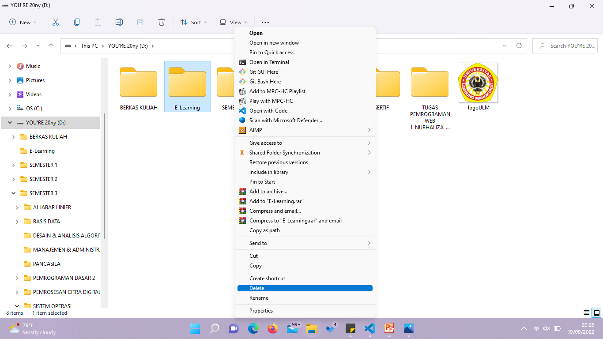

 Pilih Show More Options

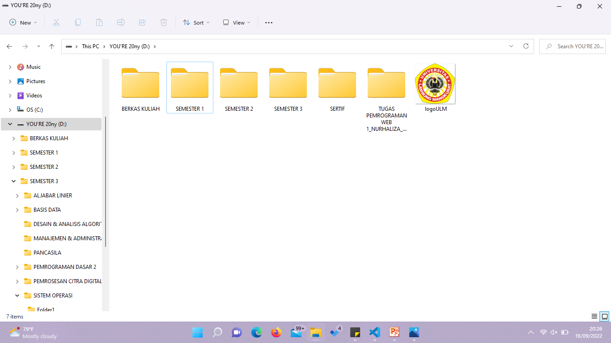

Pilih Delete 

Berkas E-Learning telah terhapus 

### 3. System Call

 System calls yang berhubungan dengan kontrol proses antara lain ketika penghentian pengeksekusian program. Baik secara normal (end) maupun tidak normal (abort).  Selama proses dieksekusi kadang kala diperlukan untuk me-load atau mengeksekusi program lain, disini diperlukan lagi suatu system calls. Juga ketika membuat suatu proses baru dan menghentikan sebuah proses. Ada juga system calls yang dipanggil ketika kita ingin meminta dan merubah atribut dari suatu proses.  MS-DOS adalah contoh dari sistem single-tasking. MS-DOS menggunakan metoda yang sederhana dalam menjalankan program aan tidak menciptakan proses baru. Program di-load ke dalam memori, kemudian program dijalankan. Berkeley Unix adalah contoh dari sistem multi-tasking. Command Interpereter masih tetap bisa dijalankan ketika program lain dieksekusi.

 Contoh system call disini adalah membuat folder, membuat file, dan menghapus dengan cmd 

 Pergi ke menu search pada laptop kemudian ketik CMD

 Buka CMD

 

* D: /untuk pergi ke local disk (D)
* mkdir [SistemOperasi] / untuk membuat folder dengan nama SistemOperasi
* cd [SistemOperasi] / untuk menuju file SistemOperasi
* Copy con Tugas3.txt / untuk membuat file dengan nama Tugas3 dengan format txt kemudian dibawahnya adalah isi filenya

 del tugas3.txt adalah untuk menghapus file tugas3

