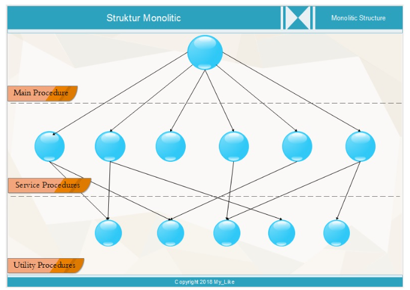
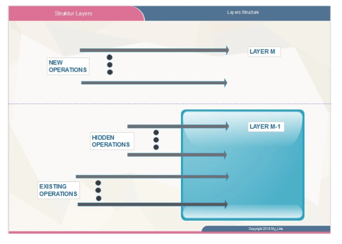

* Nama : Maisya Puspita Sari
* NIM : 2110131320006
* Tugas : Tugas 4 Perbedaan Struktur Sistem Operasi Sederhana, Berlapis dan Mikrokernel
______

### 1. Struktur Sederhana

 Sistem monolitik merupakan struktur sistem operasi sederhana yang dilengkapi dengan operasi “dual” pelayanan {sistem call} yang diberikan oleh sistem operasi. <b>Model sistem call dilakukan dengan cara mengambil sejumlah parameter pada tempat yang telah ditentukan sebelumnya, seperti register atau stack dan kemudian mengeksekusi suatu intruksi trap tertentu pada monitor mod</b>. Pada model ini, tiap-tiap sistem call memiliki satu service procedure. Utility procedure mengerjakan segala sesuatu yang dibutuhkan oleh beberapa service procedure, seperti mengambil data dari user program.

Mekanisme dan prinsip kerja model struktur monolitik sistem operasi ini adalah sebagai berikut:

 

Penjelasan Program gambar di atas

1. User program melakukan “trap” pada karnel
2. Intruksi berpindah dari user mode ke monitor mode dan mentransfer control ke sistem operasi.
3. Sistem operasi mengecek parameter — parameter dari pemanggilan tersebut, untuk menentukan sistem call mana yang memanggil.
4. Sistem operasi menunjuk ke suatu table yang berisi slot ke-k yang menunjuk sistem call K (Kontrol).
5. Kontrol akan dikembalikan kepada user program, jika sistem call telah selesai mengerjakan tugasnya.

Tatanan ini memberikan suatu struktur dasar dari sistem operasi sebagai berikut :
- Program utama meminta service procedure.
- Kumpulan service procedure yang dibaca oleh sistem call.
- Kumpulan utility procedure yang membantu service procedure.

Pada model ini, tiap-tiap sistem call memiliki satu <i>service procedure</i>. <i>Ulitity procedure</i> mengerjakan segala sesuatu yang dibutuhkan oleh beberapa service procedure, seperti mengambil data dari user program, seperti terlihat pada gambar di atas.

 

1.  *Main Procedure* adalah suatu program yang digunakan untuk memanggil salah satu dari service prosedures, dan juga meminta pelayanan dari service procedures.

2.  *Service Prosedures* adalah program yang diginakan untuk menjalankan fungsi pemanggilan procedures yang mana procedures itu harus di aktifkan.

3.  *Utility Procedures* adalah program dasar yang digunakan untuk mengendalikan sistem komputer dan juga untuk mengerjakan apa yang dibutuhkan oleh service procedures.

### 2. Sistem Berlapis

 Teknik pendekatan struktur sistem berlapis sistem operasi pada dasarnya dibuat menggunakan <b>pendekatan top-down</b>, semua fungsi ditentukan dan dibagi menjadi komponen komponen. Modularisasi sistem dilakukan dengan cara memecah sistem operasi menajdi beberapa lapis (tingkat). Lapisan terendah (layer 0) adalah perangkat keras dan lapisan teratas (layer N) adalah user interface. <b>Dengan system modularisasi, setiap lapisan mempunyai fungsi (operasi) tertentu dan melayani lapisan yang lebih rendah</b>.

 System operasi pertama kali yang memakai system berlapis adalah THE. System operasi THE yang dibuat oleh Dijkstra dan mahasiswa-mahasiswanya. Pada dasarnya system operasi berlapis dimaksudkan untuk mengurangi kompleknya rancangan dan implementasi dari suatu system operasi. Contoh sistem operasi yang menggunakan sistem ini adalah: UNIX termodifikasi, THE, Venus dan OS/2..

Menurut Stallings, model tingkatan sistem operasi yang mengaplikasikan prinsip ini dapat dilihat pada tabel berikut, yang terdiri dari level-level dibawah ini:
* Lapisan 1. Berisi berbagai sirkuit elektronik, misal register, memory cells, dan logic gate.
* Lapisan 2. Berisi instruksi prosesor, misal instruksi aritmatika, instruksi transfer data, dsb.
* Lapisan 3. Penambahan konsep seperti prosedur/subrutin, maupun fungsi yang me-return nilai tertentu.
* Lapisan 4. Penambahan interrupt.
* Lapisan 5. Program sebagai sekumpulan instruksi yang dijalankan oleh prosesor.
* Lapisan 6. Berhubungan dengan secondary storage device, yaitu membaca/menulis head, track, dan sektor.
* Lapisan 7. Menciptakan alamat logika untuk proses. Mengatur hubungan antara main memory,virtual memory, dan secondary memory.
* Lapisan 8. Program sebagai sekumpulan instruksi yang dijalankan oleh prosesor.
* Lapisan 9. Berhubungan dengan secondary storage device, yaitu membaca/menulis head,track, dan sektor.
* Lapisan 10. Menciptakan alamat logika untuk proses. Mengatur hubungan antara main memory, virtual memory, dan secondary memory.
* Lapisan 11. Program sebagai sekumpulan instruksi yang dijalankan oleh prosesor
* Lapisan 12. File adalah objek yang memiliki nama dan ukuran. Abstraksi dari lapisan 9
* Lapisan 13. Menyediakan interface agar bisa berinteraksi dengan pengguna.

Sedangkan Menurut Tanenbaum dan Woodhull, sistem terlapis terdiri dari enam lapisan, yaitu:
* Lapis 5 – The operator
Berfungsi untuk pemakai operator.
* Lapis 4 – User programs
Berfungsi untuk aplikasi program pemakai.
* Lapis 3 – I/O management
Berfungsi untuk menyederhanakan akses I/O pada level atas.
* Lapis 2 - Operator-operator communication
Berfungsi untuk mengatur komunikasi antar proses.
* Lapis 1 - Memory and drum management
Berfungsi untuk mengatur alokasi ruang memori atau drum magnetic.
* Lapis 0 - Processor allocation and multiprogramming
Berfungsi untuk mengatur alokasi pemroses dan switching, multi programming dan pengaturan prosessor

 Generalisasi lebih lanjut dari konsep layering hadir di MULTICS sistem. Alih-alih lapisan, MULTICS digambarkan memiliki serangkaian konsentris cincin, dengan bagian dalam lebih diistimewakan daripada bagian luar (yang secara efektif adalah hal yang sama). Ketika sebuah prosedur di cincin luar ingin memanggil prosedur di cincin dalam, itu harus membuat setara dengan panggilan sistem, yaitu, instruksi TRAP yang parameternya diperiksa dengan cermat validitasnya sebelum
panggilan diizinkan untuk dilanjutkan. Meskipun seluruh sistem operasi adalah bagian dari ruang alamat setiap proses pengguna di MULTICS, perangkat keras memungkinkan untuk menunjuk prosedur individu (segmen memori, sebenarnya) sebagai yang dilindungi terhadap membaca, menulis, atau mengeksekusi. Padahal skema THE layering sebenarnya hanya sebagai bantuan desain, karena semua
bagian dari sistem pada akhirnya dihubungkan bersama menjadi satu program yang dapat dieksekusi, di MULTICS, mekanisme cincin sangat banyak hadir pada waktu berjalan dan diterapkan oleh perangkat keras. Keuntungan dari mekanisme cincin adalah dapat dengan mudah diperluas ke struktur subsistem pengguna. Misalnya, seorang profesor dapat menulis program untuk menguji dan menilai program siswa dan menjalankan program ini di ring n, dengan
program siswa berjalan di ring n + 1 sehingga mereka tidak dapat mengubahnya nilai

### 3. Struktur Mikrokernel

 Metode struktur ini adalah menghilangkan komponen-komponen yang tidak diperlukan dari kernel dan mengimplementasikannya sebagai sistem dan program-program level user. Hal ini akan menghasilkan kernel yang kecil. <b>Fungsi utama dari jenis ini adalah menyediakan fasilitas komunikasi antara program client dan bermacam pelayanan yang berjalan pada ruang user.</b>

 Sistem operasi yang menggunakan micro kernel umumnya secara dramatis memiliki kinerja di bawah kinerja sistem operasi yang menggunakan monolithic kernel. Hal ini disebabkan oleh adanya overhead yang terjadi akibat proses input/output dalam kernel yang ditujukan untuk mengganti konteks (context switch) untuk memindahkan data antara aplikasi dan server.

Dalam teorinya, sistem operasi yang menggunakan microkernel dinamakan jauh bertambah stabil dibandingkan dengan monolithic kernel, karena sebuah server yang gagal memperagakan pekerjaan, tidak akan menyebabkan kernel dijadikan tidak bisa berlanjut, dan server tersebut akan dihentikan oleh kernel utama. Akan tetapi, dalam prakteknya, anggota dari system state bisa hilang oleh server yang gagal memperagakan pekerjaan tersebut, dan biasanya untuk memperagakan anggota eksekusi aplikasi pun dijadikan sulit, atau bahkan untuk menjalankan server-server lainnya. Keuntungan dari model struktur sistem operasi berlapis adalah memiliki semua keunggulan rancangan modular. Sistem terbagi dalam beberapa modul, setiap modul dan lapisan bisa dirancang, di uji, secara independen sehingga jika terjadi suatu kesalahan mudah untuk menanganinya. Sementara kelema-han dari sistem ini adalah semua fungsi-fungsi dari sistem operasi harus ter-dapat di masing-masing lapisan, jika terjadi suatu kesalahan bisa jadi semua lapisan harus diprogram ulang.

Contoh Sistem operasi yang menggunakan struktur ini adalah : TRU64 UNIX, MacOSX dan QNX.

**Buku ANDREW S. TANENBAUM HERBERT BOS**

Di luar kernel, sistem terstruktur sebagai tiga lapisan proses yang semuanya berjalan dalam mode pengguna. Lapisan terendah berisi driver perangkat. Sejak mereka berlari masuk mode pengguna, mereka tidak memiliki akses fisik ke ruang port I/O dan tidak dapat mengeluarkan Perintah I/O secara langsung. Sebagai gantinya, untuk memprogram perangkat I/O, driver membangun struktur yang memberi tahu nilai mana yang akan ditulis ke port I/O mana dan membuat panggilan kernel yang memberi tahu kernel untuk melakukan penulisan. Pendekatan ini berarti bahwa kernel dapat memeriksa untuk melihat
bahwa driver sedang menulis (atau membaca) dari I/O yang diizinkan untuk digunakan. Akibatnya (dan tidak seperti desain monolitik), driver audio buggy tidak dapat menulis secara tidak sengaja pada disk.

Di atas driver adalah lapisan mode pengguna lain yang berisi server, yang melakukan sebagian besar pekerjaan sistem operasi. Satu atau lebih file server mengelola file sistem, manajer proses membuat, menghancurkan, dan mengelola proses, dan sebagainya pada. Program pengguna memperoleh layanan sistem operasi dengan mengirimkan pesan singkat ke server meminta panggilan sistem POSIX. Misalnya, suatu proses perlu lakukan pembacaan mengirim pesan ke salah satu server file yang memberitahukannya apa yang harus dibaca.

Salah satu server yang menarik adalah server reinkarnasi, yang tugasnya adalah memeriksa apakah server dan driver lain berfungsi dengan benar. Dalam hal yang salah adalah terdeteksi, secara otomatis diganti tanpa campur tangan pengguna. Lewat sini,
sistem penyembuhan diri dan dapat mencapai keandalan yang tinggi.
Sistem memiliki banyak batasan yang membatasi kekuatan setiap proses. Seperti disebutkan, driver hanya dapat menyentuh port I/O resmi, tetapi akses ke panggilan kernel juga dikendalikan pada basis per-proses, seperti kemampuan untuk mengirim pesan ke proses lain. Proses juga dapat memberikan izin terbatas untuk proses lain untuk memiliki kernel mengakses ruang alamat mereka. Sebagai contoh, sistem file dapat memberikan izin untuk driver disk untuk membiarkan kernel menempatkan blok disk yang baru dibaca pada lokasi tertentu.

Jumlah total dari semua batasan ini adalah bahwa setiap driver dan server memiliki kekuatan yang tepat untuk melakukan pekerjaannya dan tidak ada apa-apa lebih, sehingga sangat membatasi kerusakan yang dapat dilakukan komponen kereta.
Gagasan yang agak terkait dengan memiliki kernel minimal adalah dengan meletakkan mekanisme untuk melakukan sesuatu di kernel tetapi bukan kebijakan. Untuk membuat poin ini lebih baik,
mempertimbangkan penjadwalan proses. Sebuah algoritma penjadwalan yang relatif sederhana adalah untuk menetapkan prioritas numerik untuk setiap proses dan kemudian membuat kernel menjalankan proses dengan prioritas tertinggi yang dapat dijalankan. Mekanismenya—di dalam kernel—adalah untuk
cari proses dengan prioritas tertinggi dan jalankan. Kebijakan—menetapkan prioritas untuk proses—dapat dilakukan oleh proses mode pengguna. Dengan cara ini, kebijakan dan mekanisme dapat dipisahkan dan kernel dapat dibuat lebih kecil.

______

<h2> S U M M A R Y </H2>

 Sehingga dapat disimpulkan bahwasanya perbedaan struktur sistem operasi sederhana, berlapis, dan mikrokernel yaitu, struktur sederhana dilakukan dengan cara ;

1. User program melakukan “trap” pada karnel
2. Intruksi berpindah dari user mode ke monitor mode dan mentransfer control ke sistem operasi.
3. Sistem operasi mengecek parameter — parameter dari pemanggilan tersebut, untuk menentukan sistem call mana yang memanggil.
4. Sistem operasi menunjuk ke suatu table yang berisi slot ke-k yang menunjuk sistem call K (Kontrol).
5. Kontrol akan dikembalikan kepada user program, jika sistem call telah selesai mengerjakan tugasnya.

Sedangkan pada sistem berlapis dilakukan dengan metode <i>top-down</i> yaitu dengan system modularisasi, setiap lapisan mempunyai fungsi (operasi) tertentu dan melayani lapisan yang lebih rendah. 

Dan terakhir, struktur mikrokernel dilakukan dengan Metode struktur menghilangkan komponen-komponen yang tidak diperlukan dari kernel dan mengimplementasikannya sebagai sistem dan program-program level user. Hal ini akan menghasilkan kernel yang kecil. Fungsi utama dari jenis ini adalah menyediakan fasilitas komunikasi antara program client dan bermacam pelayanan yang berjalan pada ruang user.

